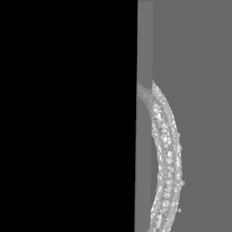

### VCP-CLIP （Accepted by ECCV 2024）


**VCP-CLIP: A visual context prompting model for zero-shot anomaly segmentation**

**(This project is being continuously updated)**

Zhen Qu, Xian Tao, Mukesh Prasad, Fei Shen, Zhengtao Zhang, Xinyi Gong, Guiguang Ding

[Paper link](https://arxiv.org/pdf/2407.12276)

## Table of Contents
* [📖 Introduction](#introduction)
* [🔧 Environments](#environments)
* [📊 Data Preparation](#data-preparation)
* [🚀 Run Experiments](#run-experiments)
* [🔗 Citation](#citation)
* [🙏 Acknowledgements](#acknowledgements)
* [📜 License](#license)

## Introduction
**This repository contains source code for VCP-CLIP implemented with PyTorch.** 


Recently, large-scale vision-language models such as CLIP have demonstrated immense potential in zero-shot anomaly segmentation (ZSAS) task, utilizing a unified model to directly detect anomalies on any unseen product with painstakingly crafted text prompts. However, existing methods often assume that the product category to be inspected is known, thus setting product-specific text prompts, which is difficult to achieve in the data privacy scenarios. Moreover, even the same type of product exhibits significant differences due to specific components and variations in the production process, posing significant challenges to the design of text prompts. In this end, we propose a visual context prompting model (VCP-CLIP) for ZSAS task based on CLIP. The insight behind VCP-CLIP is to employ visual context prompting to activate CLIP’s anomalous semantic perception ability. In specific, we first design a Pre-VCP module to embed global visual information into the text prompt, thus eliminating the necessity for product-specific prompts. Then, we propose a novel Post-VCP module, that adjusts the text embeddings utilizing the fine-grained features of the images. In extensive experiments conducted on 10 real-world industrial anomaly segmentation datasets, VCP-CLIP achieved state-of-the-art performance in ZSAS task.


## Environments
Create a new conda environment and install required packages.
```
conda create -n VCP_env python=3.9
conda activate VCP_env
conda install pytorch==1.13.1 torchvision==0.14.1 torchaudio==0.13.1 pytorch-cuda=11.7 -c pytorch -c nvidia
```

**Experiments are conducted on a NVIDIA RTX 3090.**


## Data Preparation
 
#### MVTec-AD and VisA 

> **1、Download and prepare the original [MVTec-AD](https://www.mvtec.com/company/research/datasets/mvtec-ad) and [VisA](https://amazon-visual-anomaly.s3.us-west-2.amazonaws.com/VisA_20220922.tar) datasets to any desired path. The original dataset format is as follows:**

```
path1
├── mvtec
    ├── bottle
        ├── train
            ├── good
                ├── 000.png
        ├── test
            ├── good
                ├── 000.png
            ├── anomaly1
                ├── 000.png
            ├── anomaly2
                ├── 000.png
        ├── ground_truth
            ├── anomaly1
                ├── 000_mask.png
            ├── anomaly2
                ├── 000_mask.png
```

```
path2
├── visa
    ├── candle
        ├── Data
            ├── Images
                ├── Anomaly
                    ├── 000.JPG
                ├── Normal
                    ├── 0000.JPG
            ├── Masks
                ├── Anomaly
                    ├── 000.png
    ├── split_csv
        ├── 1cls.csv
        ├── 1cls.xlsx
```

> **2、Standardize the MVTec-AD and VisA datasets to the same format and generate the corresponding .json files.**

- run **./dataset/make_dataset_new.py** to generate standardized datasets **./dataset/mvisa/data/visa** and **./dataset/mvisa/data/mvtec**
- run **./dataset/make_meta.py** to generate **./dataset/mvisa/data/meta_visa.json** and **./dataset/mvisa/data/meta_mvtec.json** (This step can be skipped since we have already generated them.)

The format of the standardized datasets is as follows:

```
./dataset/mvisa/data
├── visa
    ├── candle
        ├── train
            ├── good
                ├── visa_0000_000502.bmp
        ├── test
            ├── good
                ├── visa_0011_000934.bmp
            ├── anomaly
                ├── visa_000_001000.bmp
        ├── ground_truth
            ├── anomaly
                ├── visa_000_001000.png
├── mvtec
    ├── bottle
        ├── train
            ├── good
                ├── mvtec_000000.bmp
        ├── test
            ├── good
                ├── mvtec_good_000272.bmp
            ├── anomaly
                ├── mvtec_broken_large_000209.bmp
        ├── ground_truth
            ├── anomaly
                ├── mvtec_broken_large_000209.png

├── meta_mvtec.json
├── meta_visa.json
```

## Run Experiments

#### Prepare the pre-trained weights
> 1、 Download the CLIP weights pretrained by OpenAI [[ViT-L-14-336](https://openaipublic.azureedge.net/clip/models/3035c92b350959924f9f00213499208652fc7ea050643e8b385c2dac08641f02/ViT-L-14-336px.pt)(default),  [ViT-B-16-224](https://openaipublic.azureedge.net/clip/models/5806e77cd80f8b59890b7e101eabd078d9fb84e6937f9e85e4ecb61988df416f/ViT-B-16.pt), [ViT-L-14-224](https://openaipublic.azureedge.net/clip/models/b8cca3fd41ae0c99ba7e8951adf17d267cdb84cd88be6f7c2e0eca1737a03836/ViT-L-14.pt)] to **./pretrained_weight/**

> 2、If you are interested, please download one of the pre-trained weights of our VCP-CLIP to **./vcp_weight/**. "train_visa.pth" indicates that the auxiliary training dataset is VisA, which you can utilize to test any products outside of the VisA dataset, and vice versa:   [[train_visa.pth](https://drive.google.com/file/d/1MOTaN2hf6ejraTzax6Fnr0fa_b2ZMzjN/view?usp=drive_link)], [[train_mvtec.pth](https://drive.google.com/file/d/1uJE25wx2OgSbVPMhR2rbOO5ey0r9UkTr/view?usp=drive_link)]. Note that if you use our pre-trained weights, you must use [[ViT-L-14-336](https://openaipublic.azureedge.net/clip/models/3035c92b350959924f9f00213499208652fc7ea050643e8b385c2dac08641f02/ViT-L-14-336px.pt)] as a default backbone.

#### Training on the seen products of auxiliary datasets

> bash train.sh

#### Testing and visualizing on the unseen products

> bash test.sh

## Visualization results

     

## Citation
Please cite the following paper if the code help your project:

```bibtex
@article{qu2024vcpclipvisualcontextprompting,
      title={VCP-CLIP: A visual context prompting model for zero-shot anomaly segmentation}, 
      author={Zhen Qu and Xian Tao and Mukesh Prasad and Fei Shen and Zhengtao Zhang and Xinyi Gong and Guiguang Ding},
      year={2024},
      eprint={2407.12276},
      archivePrefix={arXiv},
      primaryClass={cs.CV},
      url={https://arxiv.org/abs/2407.12276}
}
```

## Acknowledgements

We thank the great works [WinCLIP(zqhang)](https://github.com/zqhang/Accurate-WinCLIP-pytorch), [WinCLIP(caoyunkang)](https://github.com/caoyunkang/WinClip), [CoCoOp](https://github.com/KaiyangZhou/CoOp), [AnVoL](https://github.com/hq-deng/AnoVL), [APRIL-GAN](https://github.com/ByChelsea/VAND-APRIL-GAN), [AnomalyGPT](https://github.com/CASIA-IVA-Lab/AnomalyGPT) and [AnomalyCLIP](https://github.com/zqhang/AnomalyCLIP) for assisting with our work.

## License
The code and dataset in this repository are licensed under the [MIT license](https://mit-license.org/).
